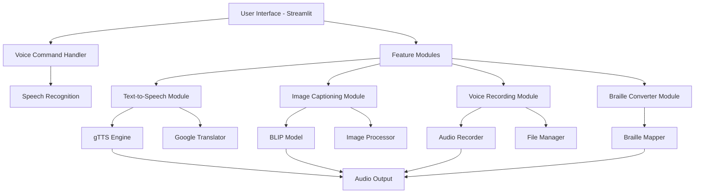

# VAANI - Empowering Inclusive Communication through AI

<div align="center">


[](https://www.python.org/downloads/)
[](https://streamlit.io/)

<p align="center">
  
  
  
</p>

</div>

## 📋 Table of Contents

- [Overview](#-overview)
- [Key Features](#-key-features)
- [Technology Stack](#-technology-stack)
- [Architecture](#-architecture)
- [Prerequisites](#-prerequisites)
- [Installation](#-installation)
- [Usage Guide](#-usage-guide)
- [API Documentation](#-api-documentation)
- [Configuration](#-configuration)
- [Troubleshooting](#-troubleshooting)

## 🌟 Overview

VAANI is an AI-powered assistive technology platform designed to empower blind and visually impaired individuals by providing inclusive access to various forms of content. Through cutting-edge AI technologies including text-to-speech synthesis, image recognition, and natural language processing, VAANI makes text-based and visual content more accessible, promoting greater independence and inclusion.

### 🎯 Mission Statement

To bridge the accessibility gap in education and daily communication for visually impaired individuals through innovative AI solutions.

## 🚀 Key Features

### 1. **Multi-Language Text-to-Speech** 🗣️
- Convert text or PDF documents into natural-sounding speech
- Support for 10+ languages including English, Hindi, Bengali, Tamil, and more
- Real-time translation between languages
- Batch processing for large documents

### 2. **AI-Powered Image Captioning** 🖼️
- Generate descriptive captions using Salesforce BLIP model
- Convert visual content into meaningful text descriptions
- Automatic speech synthesis of generated captions
- History tracking for processed images

### 3. **Voice Recording & Management** 🎙️
- Record and save voice notes with custom naming
- Playback functionality with deletion options
- WAV format support for high-quality audio
- Organized file management system

### 4. **Braille-to-Speech Conversion** 📖
- Support for Grade 1 Braille (Uncontracted)
- Real-time conversion to text and speech
- Unicode Braille pattern recognition
- Educational support for Braille learners

### 5. **Voice Command Interface** 🎤
- Hands-free navigation through voice commands
- Natural language processing for command recognition
- Support for all major features via voice
- Accessibility-first design approach

## 🛠️ Technology Stack

<div align="center">

| Category | Technologies |
|----------|-------------|
| **Frontend** |    |
| **AI/ML** |   |
| **Audio Processing** |    |
| **Language** |  |
| **Libraries** |    |
| **Translation** |  |

</div>

## 🏗️ Architecture



## 📋 Prerequisites

### System Requirements

- **OS**: Windows 10/11, macOS 10.15+, Ubuntu 20.04+
- **Python**: 3.8 or higher
- **RAM**: Minimum 4GB (8GB recommended for smooth performance)
- **Storage**: At least 2GB free space for models and dependencies
- **Internet**: Required for model downloads and translation services
- **Audio**: Working microphone and speakers

### Software Dependencies

- Python 3.8+
- pip (Python package installer)
- Virtual environment tool (venv or conda)
- Git for cloning the repository

## 🚀 Installation

### Step 1: Clone the Repository

```bash
git clone https://github.com/yourusername/VAANI-AI-Assistant.git
cd VAANI-AI-Assistant
```

### Step 2: Create Virtual Environment

**Windows:**
```bash
python -m venv venv
venv\Scripts\activate
```

**macOS/Linux:**
```bash
python3 -m venv venv
source venv/bin/activate
```

### Step 3: Install Dependencies

```bash
pip install --upgrade pip
pip install -r requirements.txt
```

### Step 4: Platform-Specific Setup

<details>
<summary><b>Windows Users</b></summary>

If you encounter issues with PyAudio:
1. Download the appropriate wheel file from [here](https://www.lfd.uci.edu/~gohlke/pythonlibs/#pyaudio)
2. Install using:
```bash
pip install path/to/downloaded/PyAudio‑0.2.11‑cp38‑cp38‑win_amd64.whl
```
</details>

<details>
<summary><b>macOS Users</b></summary>

Install PortAudio first:
```bash
brew install portaudio
pip install pyaudio
```
</details>

<details>
<summary><b>Linux Users</b></summary>

Install system dependencies:
```bash
sudo apt-get update
sudo apt-get install portaudio19-dev python3-pyaudio
sudo apt-get install tesseract-ocr
pip install pyaudio
```
</details>

### Step 5: Download AI Models (First Run)

The BLIP model will be automatically downloaded on first use (~1.7GB).

## 📖 Usage Guide

### Starting the Application

```bash
streamlit run app.py
```

The application will open in your default browser at `http://localhost:8501`

### Feature Walkthroughs

#### 1. **Text-to-Speech Conversion** 🔊

1. Navigate to "Text-to-Speech" from the menu
2. Choose input method:
   - **Text Input**: Type or paste text directly
   - **PDF Upload**: Upload a PDF document
3. Select source language (language of your text)
4. Select target language (desired output language)
5. Click "Convert Text to Speech"
6. Listen to the generated audio

#### 2. **Image Description** 🖼️

1. Go to "Image Description"
2. Upload an image (JPG, JPEG, or PNG)
3. Click "Generate Caption"
4. Read the AI-generated description
5. Listen to the audio narration
6. View history in the sidebar

#### 3. **Voice Recording** 🎙️

1. Select "Record Voice Note"
2. Enter a filename (optional, defaults to "recording")
3. Click "Start Recording"
4. Speak your message (30-second limit)
5. Recording auto-saves when complete
6. Manage saved recordings:
   - Play back recordings
   - Delete unwanted files
   - Download for sharing

#### 4. **Braille Reading** 📖

1. Choose "Read Braille"
2. Enter Braille text using Unicode characters
3. Example: `⠓⠑⠇⠇⠕` (hello)
4. Click "Read Braille"
5. Listen to the converted speech

#### 5. **Voice Commands** 🎤

1. Select "Voice Command"
2. Allow microphone access when prompted
3. Speak clearly one of these commands:
   - "Text to Speech"
   - "Image Description"
   - "Record Voice Note"
   - "Read Braille"
   - "Description"
4. Follow the voice prompts

### Supported Languages 🌍

| Language | Code | Native Name |
|----------|------|-------------|
| English | en | English |
| Hindi | hi | हिन्दी |
| Bengali | bn | বাংলা |
| Gujarati | gu | ગુજરાતી |
| Malayalam | ml | മലയാളം |
| Marathi | mr | मराठी |
| Tamil | ta | தமிழ் |
| Telugu | te | తెలుగు |
| Urdu | ur | اردو |
| Kannada | kn | ಕನ್ನಡ |

## 📁 Project Structure

```
VAANI-AI-Assistant/
│
├── app.py                    # Main Streamlit application
├── braille_converter.py      # Braille to text conversion logic
├── image_processing.py       # Image captioning with BLIP model
├── pdf_processing.py         # PDF text extraction utilities
├── text_to_speech.py         # TTS and translation services
├── requirements.txt          # Python dependencies
├── README.md                 # Project documentation
│
├── recordings/              # Directory for saved voice recordings
│   └── *.wav               # Audio files
│
├── models/                  # AI model cache (auto-created)
│   └── blip-image-captioning-large/
│
└── logs/                    # Application logs (if enabled)
    └── app.log
```

## 🔧 Configuration

### Environment Variables

Create a `.env` file in the project root for custom configurations:

```env
# Model Configuration
TRANSFORMERS_CACHE=./models
MODEL_NAME=Salesforce/blip-image-captioning-large

# Audio Settings
AUDIO_SAMPLE_RATE=44100
AUDIO_CHANNELS=2
MAX_RECORDING_DURATION=30

# Language Settings
DEFAULT_INPUT_LANGUAGE=en
DEFAULT_OUTPUT_LANGUAGE=en

# UI Settings
STREAMLIT_THEME=dark
```

### Advanced Settings

#### Custom Braille Mapping

Edit `braille_converter.py` to add more Braille patterns:

```python
braille_to_text_mapping = {
    '⠁': 'a', '⠃': 'b', '⠉': 'c',
    # Add more mappings here
    '⠲': '.', '⠦': '?', '⠖': '!'
}
```

#### Model Selection

To use a different image captioning model, modify `image_processing.py`:

```python
processor = BlipProcessor.from_pretrained("your-model-name")
model = BlipForConditionalGeneration.from_pretrained("your-model-name")
```

## 🐛 Troubleshooting

### Common Issues and Solutions

<details>
<summary><b>1. ModuleNotFoundError</b></summary>

**Error**: `ModuleNotFoundError: No module named 'module_name'`

**Solution**:
```bash
pip install -r requirements.txt
```
</details>

<details>
<summary><b>2. Microphone Access Issues</b></summary>

**Error**: `OSError: [Errno -9999] Unanticipated host error`

**Solutions**:
- Check system microphone permissions
- Run as administrator (Windows)
- Check Privacy Settings → Microphone (macOS)
- Test microphone with system recorder
</details>

<details>
<summary><b>3. Model Download Failures</b></summary>

**Error**: `HTTPError: 503 Server Error`

**Solutions**:
- Check internet connection
- Clear cache: `rm -rf ~/.cache/huggingface/`
- Use VPN if model hub is blocked
- Download models manually and place in `./models/`
</details>

<details>
<summary><b>4. PyAudio Installation Error</b></summary>

**Error**: `error: Microsoft Visual C++ 14.0 is required`

**Solutions**:
- Install Visual Studio Build Tools
- Use pre-compiled wheel (see Installation section)
- Try conda: `conda install pyaudio`
</details>

<details>
<summary><b>5. PDF Processing Issues</b></summary>

**Error**: `PyPDF2.utils.PdfReadError`

**Solutions**:
- Ensure PDF is not encrypted
- Try different PDF reader: `pip install pdfplumber`
- Convert PDF to text format first
</details>

**Made with ❤️ for inclusive education**

</div>